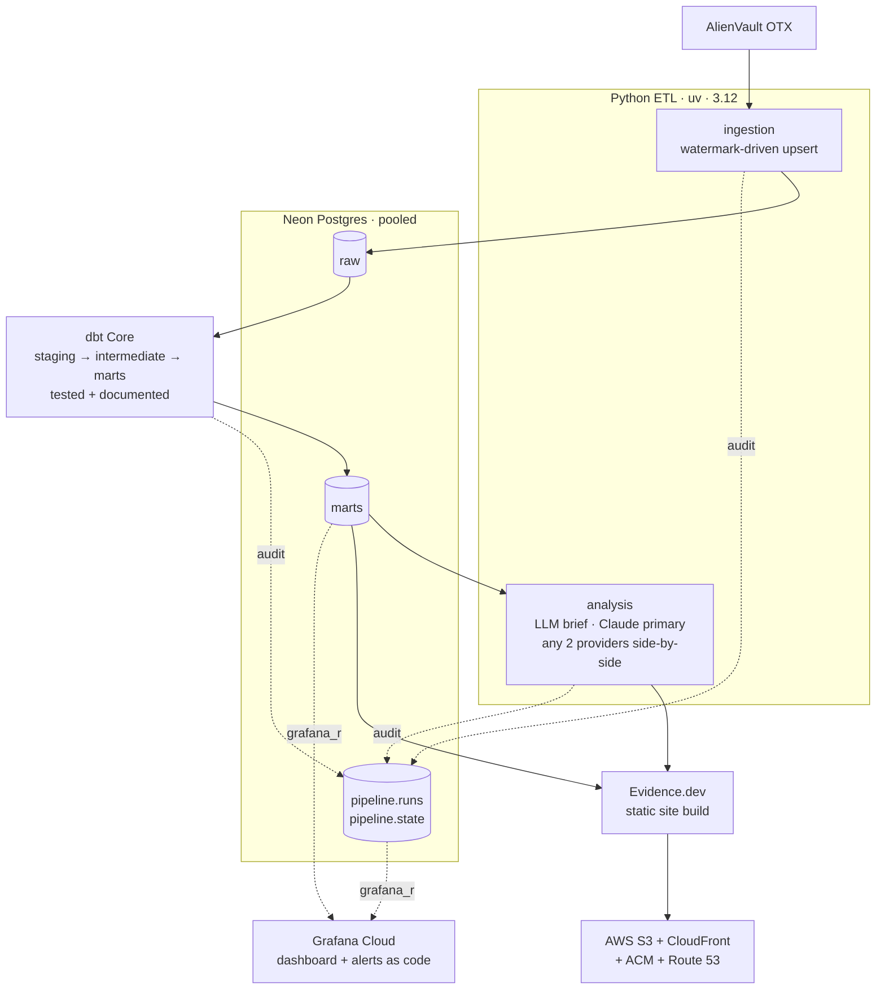

# cyber-threat-pipeline

An incremental, watermark-driven pipeline that turns the **AlienVault OTX** threat-intelligence feed into a longitudinal dataset, transforms it with tested and documented **dbt** models in **Neon Postgres**, publishes a static **Evidence.dev** analytical site, and instruments the pipeline itself with live **Grafana Cloud** observability and alerting.

This is the modern-data-stack successor to [`Threat-Intel-ETL`](https://github.com/marky224/Threat-Intel-ETL). The legacy Splunk surface is removed; the new shape is **AI / Data / Analytics Engineering**.

## Architecture



**→ Full annotated breakdown:** [`docs/architecture.md`](docs/architecture.md) (components, data flow, trust boundaries).

Orchestrated by a single weekly **GitHub Actions** cron (plus manual dispatch); a separate CI workflow runs lint, type-check, and tests on every push.

## Live

| Surface | URL |
|---|---|
| **Evidence.dev analytical site** | <https://cyber-intel.markandrewmarquez.com/> |
| **Grafana operational dashboard** (public share) | <https://mec104e.grafana.net/public-dashboards/c5f4b57d91aa4e2395a4899fc74dc55f> |

Both surfaces are refreshed every Monday by the weekly cron in `.github/workflows/pipeline.yml`.

### Evidence site preview

| Home — corpus overview | Analyst Brief — LLM-generated | Freshness & Data Quality |
|---|---|---|
| [](https://cyber-intel.markandrewmarquez.com/) | [](https://cyber-intel.markandrewmarquez.com/analyst-brief) | [](https://cyber-intel.markandrewmarquez.com/freshness) |

## The Evidence / Grafana split

These two surfaces are deliberately separated:

- **Evidence.dev — the analysis.** Point-in-time, narrative, "what the threat intel *says*." Queries Postgres at build time, bakes results into a static site. Recruiter-facing.
- **Grafana Cloud — the operations.** Time-series, live, "is the pipeline healthy and can I *trust* the data," with alerting. Backed by a read-only Neon role scoped to `marts` and `pipeline_runs`.

The litmus test: *is this about what the data **means** (→ Evidence) or about the **health** of the pipeline / data asset (→ Grafana)?*

## How a weekly run executes

Every Monday at 09:00 UTC, [`.github/workflows/pipeline.yml`](.github/workflows/pipeline.yml) walks five stages:

1. **Ingest** (`make ingest`) — pulls OTX pulses modified since the last successful watermark in `pipeline.state`, transforms them in pandas, idempotently upserts into Neon's `raw` schema.
2. **Transform** (`make transform`) — the isolated dbt env builds 9 marts (staging → intermediate → marts), runs schema + data tests, and captures the result.
3. **Analyse** (`make analysis`) — the configured primary + secondary LLM providers each render the same prompt against the current marts; the side-by-side output replaces `reporting/pages/analyst-brief.md` (gitignored, regenerated each run).
4. **Publish** (`make report`) — Evidence builds the static site, syncs to S3 under the GitHub-OIDC deploy role, invalidates CloudFront.
5. **Audit** — each stage writes a row to `pipeline.runs` with status, row counts, and dbt test outcomes. Grafana reads this table through the read-only `grafana_ro` role; a failure trips the `ctp-run-failure` alert.

Every step is reproducible locally with the same `make` target — local dev and CI run identical commands.

## Key engineering decisions

Choices that shaped the build, in case you're skimming for judgment rather than just stack:

- **Two surfaces, one source of truth.** Evidence (analysis) and Grafana (operations) both read from Neon but answer different questions — the [litmus test above](#the-evidence--grafana-split) decides where a new query belongs. Built-in discipline against blurring the two.
- **Watermark-driven, idempotent ingest.** `pipeline.state.modified_since` advances only on success, so every run is replayable. Audit rows in `pipeline.runs` are the canonical "did this run actually work" signal — and the same table is what Grafana renders.
- **Provider-agnostic LLM analyst.** Claude is the primary, but the analyst is built to swap providers via a single env-var (`ANALYSIS_PRIMARY_PROVIDER`). Any two providers render side-by-side on the brief page, so model-to-model variance on the same input is observable instead of hidden.
- **Least-privilege observability.** Grafana connects as `grafana_ro`, scoped to `marts` + `pipeline_runs`. The ops dashboard can't widen access if its credentials leak.
- **OIDC-only AWS access.** GitHub Actions assumes a Terraform-managed IAM role via OIDC for S3 + CloudFront deploys — no long-lived AWS keys live in repo secrets, and the trust policy pins to `ref:refs/heads/main` + `environment:production`.
- **Single `Makefile`, two callers.** Local dev and CI invoke the same targets (`make ingest`, `make transform`, `make analysis`, `make report`). If something only works in CI, that's a bug.
- **Alerts and dashboards as code.** Grafana state lives in `monitoring/dashboard.json` + `monitoring/alerts.yaml`. Drift shows up in `git diff`, not by surprise during an incident.

## Stack

| Area | Tool |
|---|---|
| Warehouse | Neon (serverless Postgres, pooled connection) |
| Ingestion | Python 3.12, `uv`, pandas, `OTXv2` SDK |
| Transformation | dbt Core (Postgres adapter) |
| Reporting | Evidence.dev → S3 + CloudFront (us-east-1) |
| Monitoring | Grafana Cloud (free tier) |
| Analyst brief | **Claude** (primary) · provider-agnostic (Grok · GPT · Gemini · local Ollama swap in via one env-var) · any two providers rendered side-by-side |
| Orchestration | GitHub Actions (weekly cron + dispatch), `Makefile` as single source of truth |
| Infra | Terraform (S3 + OAC + CloudFront + ACM + Route 53 + GitHub OIDC role) |
| Lint / types / tests | ruff · mypy · pytest · pre-commit |

## Repository layout

```
cyber_threat_pipeline/   Python app package (core/, ingestion/, analysis/)
sql/                     Raw schema + pipeline_runs + pipeline_state + grafana_ro role
transform/               dbt Core project (isolated env)
reporting/               Evidence.dev project (Node)
monitoring/              Grafana dashboards + alert rules as code
infra/                   Terraform (deploy bucket, CDN, DNS, OIDC role)
tests/                   pytest
docs/                    Public assets (architecture diagrams, etc.)
.github/workflows/       ci.yml (push/PR) + pipeline.yml (weekly cron + dispatch)
```

## Status

**Feature-complete.** Shipped in seven dedicated phases (`sql/` → `ingestion/` → `transform/` → `analysis/` → `reporting/` + `infra/` → `monitoring/` → orchestration), each with its own PR.

| Phase | Component | Status |
|---|---|---|
| 1 | `sql/` — schemas, raw + pipeline tables, `grafana_ro` role | ✅ shipped |
| 2 | `cyber_threat_pipeline/{core,ingestion}/` — OTX → Neon raw | ✅ shipped |
| 3 | `transform/` — dbt Core project (9 marts, isolated dbt env) | ✅ shipped |
| 4 | `cyber_threat_pipeline/analysis/` — LLM analyst brief (Claude primary, 5 providers swappable) | ✅ shipped |
| 5 | `reporting/` + `infra/` — Evidence (Node 20, postgres datasource, 3 pages) + Terraform (S3 + CloudFront + ACM + Route 53 + GitHub OIDC + deploy role) | ✅ shipped |
| 6 | `monitoring/` — Grafana dashboards + alerts as code (5 panels, 4 alerts, JSON+YAML, no UI state) | ✅ shipped |
| 7 | `.github/workflows/` orchestration polish + Makefile final wiring (dbt-test-result capture into `pipeline.runs`, env-var passthrough, fail-fast checks) | ✅ shipped |

Every weekly cron writes a full `pipeline.runs` audit row, the Evidence site refreshes, the Grafana dashboard shows the live operational view, and the analyst brief is regenerated by the configured primary LLM provider (Claude in production).

## Local development

```bash
make install      # uv sync (Python 3.12 dev env)
make lint         # ruff
make typecheck    # mypy
make test         # pytest
```

Stage commands (`make ingest`, `make transform`, `make analysis`, `make report`, `make all`) run the same targets that the weekly cron invokes — see [How a weekly run executes](#how-a-weekly-run-executes) for what each stage does.

## License

© 2026 Mark Andrew Marquez. All rights reserved.

Licensed under the [PolyForm Strict License 1.0.0](LICENSE) — source-available for personal study and noncommercial evaluation. **Distribution, modification, derivative works, and forks intended for reuse require prior written permission.** Open an issue or email me if you want to use any part of this elsewhere.
