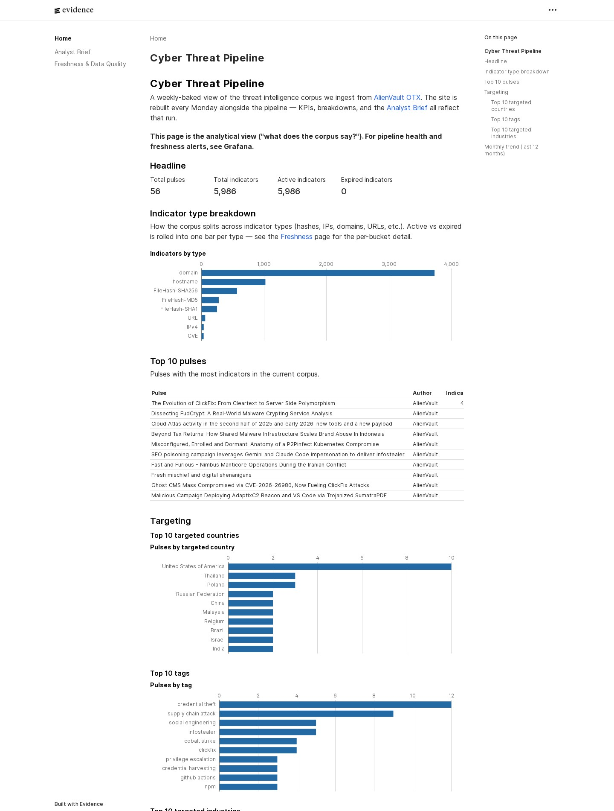
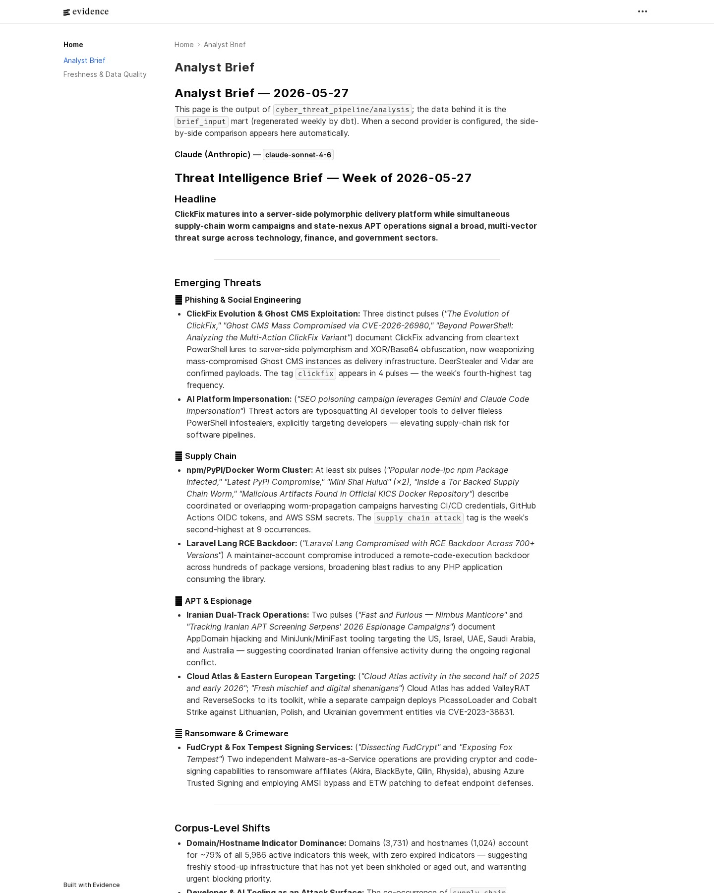
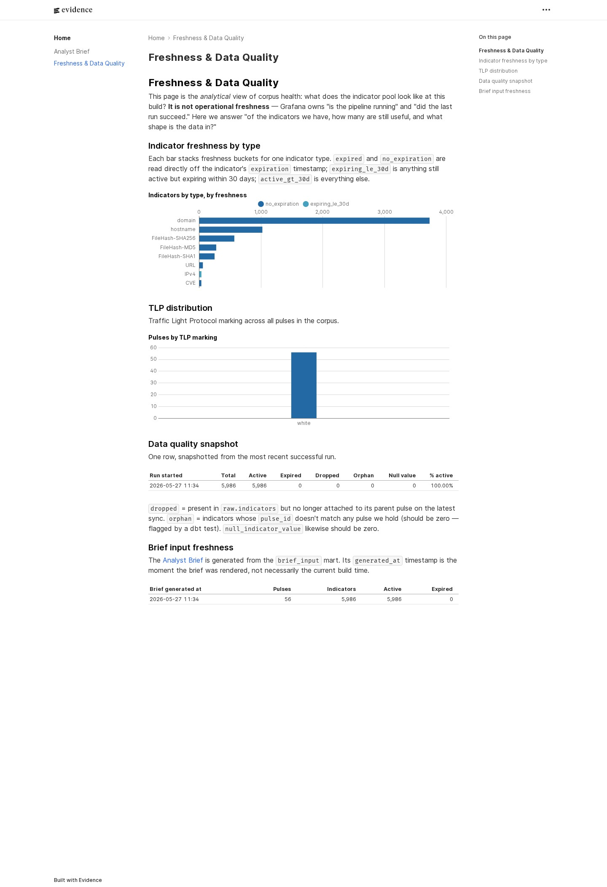
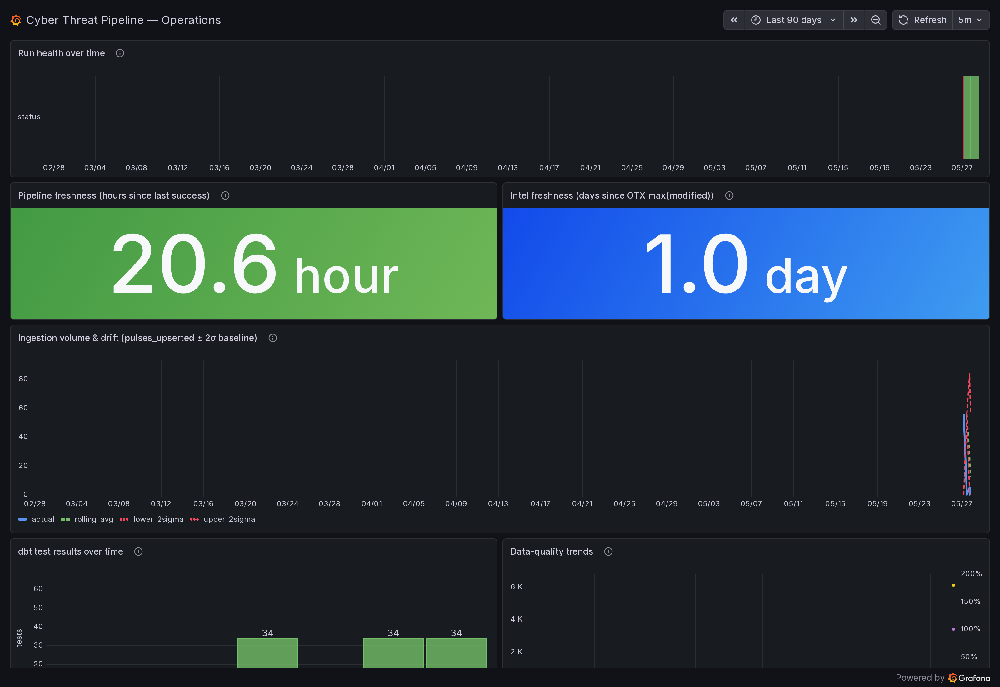

# cyber-threat-pipeline

An incremental, watermark-driven pipeline that turns the **AlienVault OTX** threat-intelligence feed into a longitudinal dataset, transforms it with tested and documented **dbt** models in **Neon Postgres**, publishes a static **Evidence.dev** analytical site, and instruments the pipeline itself with live **Grafana Cloud** observability and alerting.

This is the modern-data-stack successor to [`Threat-Intel-ETL`](https://github.com/marky224/Threat-Intel-ETL). The legacy Splunk surface is removed; the new shape is **AI / Data / Analytics Engineering**.

## Architecture

```
AlienVault OTX
   │  (incremental pull via modified_since)
   ▼
Python ETL (cyber_threat_pipeline/ingestion)
   │  extract → transform (pandas) → load (idempotent upsert)
   ▼
Neon Postgres ── raw schema ──►  dbt (transform/)  ──► marts schema
   │                                                      │
   │ (read-only role)                                     │ (build-time queries)
   ▼                                                      ▼
Grafana Cloud (monitoring/)                         Evidence.dev (reporting/)
  Pipeline health — LIVE, operational, alerting     Static site → S3 + CloudFront
```

**→ Full annotated breakdown with detailed system diagram:** [`docs/architecture.md`](docs/architecture.md) (Mermaid diagram, per-component notes, data flow, trust boundaries).

Orchestrated by a single weekly **GitHub Actions** cron (plus manual dispatch); a separate CI workflow runs lint, type-check, and tests on every push. The Grafana dashboard and its alert rules ship as JSON + YAML in `monitoring/` — no UI-edited state — so any operational drift shows up in `git diff`, not by surprise during an incident.

## Live

| Surface | URL |
|---|---|
| **Evidence.dev analytical site** | <https://cyber-intel.markandrewmarquez.com/> |
| **Grafana operational dashboard** (public share) | <https://mec104e.grafana.net/public-dashboards/c5f4b57d91aa4e2395a4899fc74dc55f> |

Both surfaces are refreshed every Monday by the weekly cron in `.github/workflows/pipeline.yml`.

### Evidence site preview

| Home — corpus overview | Analyst Brief — LLM-generated | Freshness & Data Quality |
|---|---|---|
| [](https://cyber-intel.markandrewmarquez.com/) | [](https://cyber-intel.markandrewmarquez.com/analyst-brief) | [](https://cyber-intel.markandrewmarquez.com/freshness) |

### Grafana dashboard preview

| Pipeline health, freshness, ingestion volume, and dbt test trends |
|---|
| [](https://mec104e.grafana.net/public-dashboards/c5f4b57d91aa4e2395a4899fc74dc55f) |

## The Evidence / Grafana split

These two surfaces are deliberately separated:

- **Evidence.dev — the analysis.** Point-in-time, narrative, "what the threat intel *says*." Queries Postgres at build time, bakes results into a static site. Recruiter-facing.
- **Grafana Cloud — the operations.** Time-series, live, "is the pipeline healthy and can I *trust* the data," with alerting. Backed by a read-only Neon role scoped to `marts` and `pipeline_runs`.

The litmus test: *is this about what the data **means** (→ Evidence) or about the **health** of the pipeline / data asset (→ Grafana)?*

## How a weekly run executes

Every Monday at 09:00 UTC, [`.github/workflows/pipeline.yml`](.github/workflows/pipeline.yml) walks five stages:

1. **Ingest** (`make ingest`) — pulls OTX pulses modified since the watermark in `pipeline.state`, transforms in pandas, idempotently upserts into Neon's `raw` schema. The watermark advances only on success, so failed runs are replayable.
2. **Transform** (`make transform`) — the isolated dbt env builds 9 marts (staging → intermediate → marts), runs schema + data tests, captures the result for the audit row.
3. **Analyse** (`make analysis`) — the configured primary + secondary LLM providers each render the same prompt against the current marts; output replaces `reporting/pages/analyst-brief.md` (gitignored, regenerated each run). Claude is the production primary; `ANALYSIS_PRIMARY_PROVIDER` swaps in Grok / GPT / Gemini / local Ollama with no code change.
4. **Publish** (`make report`) — Evidence builds the static site, syncs to S3 under the GitHub-OIDC deploy role, invalidates CloudFront.
5. **Audit** — each stage writes a row to `pipeline.runs` with status, row counts, and dbt test outcomes. Grafana reads this table through the read-only `grafana_ro` role; a failure trips the `ctp-run-failure` alert.

Every stage is reproducible locally with the same `make` target — local dev and the weekly cron invoke identical commands.

## Security posture

**Least-privilege observability.** Grafana Cloud connects to Neon as `grafana_ro`, scoped strictly to `marts` and `pipeline.runs`. The application role used by ingest, dbt, and the analyst is separate and only runs from inside the GitHub Actions cron.

**OIDC-only AWS access.** Site deploys assume an IAM role via GitHub's OIDC provider — no long-lived AWS keys in repo secrets. The trust policy is pinned to `ref:refs/heads/main` + `environment:production`, and the OIDC provider itself is a Terraform `data` lookup so the same code works whether the AWS account already has one or not.

## Stack

| Area | Tool |
|---|---|
| Warehouse | Neon (serverless Postgres, pooled connection) |
| Ingestion | Python 3.12, `uv`, pandas, `OTXv2` SDK |
| Transformation | dbt Core (Postgres adapter) |
| Reporting | Evidence.dev → S3 + CloudFront (us-east-1) |
| Monitoring | Grafana Cloud (free tier) |
| Analyst brief | **Claude** (primary) · provider-agnostic (Grok · GPT · Gemini · local Ollama swap in via one env-var) · any two providers rendered side-by-side |
| Orchestration | GitHub Actions (weekly cron + dispatch), `Makefile` as single source of truth |
| Infra | Terraform (S3 + OAC + CloudFront + ACM + Route 53 + GitHub OIDC role) |
| Lint / types / tests | ruff · mypy · pytest · pre-commit |

## Repository layout

```
cyber_threat_pipeline/      Python app package
├── core/                   Config (pydantic-settings), logging, Neon connection helpers
├── ingestion/              OTX extract → pandas transform → idempotent upsert into `raw` · watermark-driven
└── analysis/               LLM analyst brief · Claude primary · 5 providers swappable · any 2 side-by-side
sql/                        Schemas (raw · marts · pipeline) + audit tables + `grafana_ro` read-only role
transform/                  dbt Core (isolated env) · 9 marts · staging → intermediate → marts · schema + data tests
reporting/                  Evidence.dev (Node 20 LTS) · 3 pages · postgres datasource via single connection-string env
monitoring/                 Grafana dashboard (5 panels) + alerts (4 rules) as code · no UI state
infra/                      Terraform · S3 + CloudFront + ACM + Route 53 + GitHub OIDC deploy role · no static AWS keys
tests/                      pytest
docs/                       architecture.md (annotated diagram) + screenshots/
.github/workflows/          ci.yml (push/PR · 6 checks) + pipeline.yml (weekly cron + dispatch)
```

## Local development

```bash
make install      # uv sync (Python 3.12 dev env)
make lint         # ruff
make typecheck    # mypy
make test         # pytest
```

Stage commands (`make ingest`, `make transform`, `make analysis`, `make report`, `make all`) run the same targets that the weekly cron invokes — see [How a weekly run executes](#how-a-weekly-run-executes) for what each stage does.

## License

© 2026 Mark Andrew Marquez. All rights reserved.

Licensed under the [PolyForm Strict License 1.0.0](LICENSE) — source-available for personal study and noncommercial evaluation. **Distribution, modification, derivative works, and forks intended for reuse require prior written permission.** Open an issue or email me if you want to use any part of this elsewhere.
