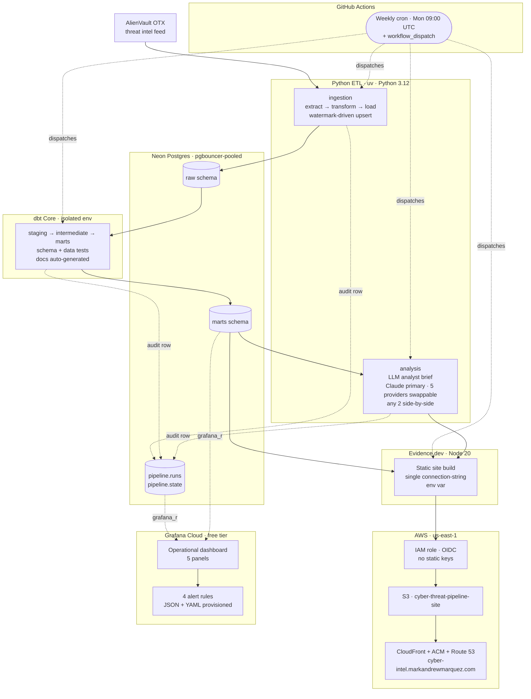

# Architecture

This document is the annotated companion to the high-level diagram in the [README](../README.md#architecture). It exists so a new reader can understand the system end-to-end without reading code — what each component does, how data flows, and where the trust boundaries sit.

## System diagram



## Components

### Sources

**AlienVault OTX** — public threat-intelligence feed (pulses, indicators, references). Accessed via the `OTXv2` Python SDK. The pipeline is read-only against OTX and uses a `modified_since` watermark for incremental fetches.

### Orchestration

**GitHub Actions** — two workflows:

- `ci.yml` runs on every push/PR: lint (ruff), type-check (mypy, strict), unit tests (pytest), gitleaks, dbt build+test, Evidence build, terraform validate.
- `pipeline.yml` runs weekly (Mon 09:00 UTC) and on manual dispatch: ingest → transform → analyse → publish. This is the *only* mechanism that writes to production Neon or deploys to AWS.

No other scheduler exists. The Makefile is the single source of truth for stage commands; both workflows invoke `make <target>`.

### Python application (`cyber_threat_pipeline/`)

Python 3.12, managed by `uv` (lockfile is authoritative). Three subpackages:

- `core/` — config (`pydantic-settings`), logging, Neon connection helpers.
- `ingestion/` — `extract` (OTX SDK) → `transform` (pandas) → `load` (idempotent `INSERT … ON CONFLICT` upsert into Neon's `raw` schema). Watermark lives in `pipeline.state.modified_since`.
- `analysis/` — LLM analyst brief. Reads from `marts`, prompts the configured **primary** and **secondary** providers (Claude · Grok · GPT · Gemini · local Ollama), writes a side-by-side markdown page consumed by Evidence.

The analyst is provider-agnostic by design: a single env-var (`ANALYSIS_PRIMARY_PROVIDER`) swaps the model behind the brief, and any two providers render in tabbed comparison on the same input. Claude is the production primary; the code default is `local` (Ollama) so dev/CI runs without any cloud API keys.

### Warehouse — Neon Postgres

Serverless Postgres (Postgres 17) reached through the pgbouncer-pooled endpoint. Three schemas:

- `raw` — landing zone for OTX records. One row per pulse / indicator / reference, with `loaded_at` timestamps. Idempotent upsert key.
- `marts` — dbt's output: dimensional and aggregate tables consumed by Evidence and Grafana.
- `pipeline` — operational tables: `pipeline.state` (watermarks, last-success timestamps) and `pipeline.runs` (one row per stage per run with status, row counts, dbt test outcomes).

Two database roles:

- The application role has full DDL/DML on `raw`, `marts`, `pipeline`.
- `grafana_ro` is read-only and scoped to `marts` + `pipeline.runs`. Grafana Cloud connects only with this role.

### Transformation — dbt Core (`transform/`)

dbt Core with the Postgres adapter, in its **own isolated environment** (its own `pyproject.toml` and venv, separate from the app env). Standard three-tier model graph:

- `staging/` — light cleanup, renames, type casts on `raw`.
- `intermediate/` — joins, deduplication, business-logic glue.
- `marts/` — the 9 published tables Evidence and Grafana query.

Every model has schema tests (`not_null`, `unique`, `relationships`) and selected data tests. `dbt build` runs models and tests in one pass; the captured test result is written into the `pipeline.runs` audit row by the orchestrator.

### Reporting — Evidence.dev (`reporting/`)

Evidence v40, Node 20 LTS (pinned in `reporting/.nvmrc`). Three pages today: home (corpus overview), analyst brief (the LLM output), freshness & data quality.

Datasource configuration is intentionally minimal: a single `EVIDENCE_SOURCE__neon__connectionString` env var holds the full Postgres URL. (Per-field env vars cause type-coercion bugs in the postgres adapter — strings can't be cast to ports/booleans cleanly. A connection string sidesteps that.)

Build output ships as a static site.

### Publishing — AWS (`infra/`)

Terraformed end-to-end:

- **S3** bucket (`cyber-threat-pipeline-site`) — origin for the static site.
- **CloudFront** distribution + **ACM** certificate + **Route 53** record — fronting `cyber-intel.markandrewmarquez.com`.
- **GitHub OIDC provider** + **IAM deploy role** — assumed by `pipeline.yml` via `aws-actions/configure-aws-credentials@v4`. No static keys exist in repo secrets. The role's trust policy pins to `ref:refs/heads/main` + `environment:production`.

The OIDC provider is a `data` lookup (not a `resource`) so the same Terraform applies cleanly whether the AWS account already has a GitHub OIDC provider or not.

### Observability — Grafana Cloud (`monitoring/`)

Grafana Cloud free tier. Two artifacts checked into git:

- `dashboard.json` — the operational dashboard (5 panels: run status timeline, rows-ingested-per-run, dbt test pass rate, freshness vs. SLA, error log).
- `alerts.yaml` — 4 alert rules (run failure, stale data, dbt test regression, ingest row-count drop), eval interval 900s.

The Grafana datasource is the `grafana_ro` Neon role. The dashboard and alerts are provisioned via the Grafana HTTP API at install time — no UI-edited state. A `<NEON_RO_UID>` placeholder in `alerts.yaml` is substituted at provisioning time from the datasource API response.

## Data flow — a single weekly run

```
1. cron fires pipeline.yml
2. make ingest
     → OTX.getall(modified_since=watermark)
     → pandas transform
     → INSERT … ON CONFLICT into raw.{pulses, indicators, references}
     → UPDATE pipeline.state SET modified_since = NOW()
     → INSERT INTO pipeline.runs (stage='ingest', status='ok', rows=…)
3. make transform
     → dbt build (in isolated env)
     → INSERT INTO pipeline.runs (stage='transform', dbt_test_outcomes=…)
4. make analysis
     → SELECT … FROM marts
     → primary_provider.complete(prompt)  ── Claude in prod
     → secondary_provider.complete(prompt)
     → write reporting/pages/analyst-brief.md (side-by-side tabs)
     → INSERT INTO pipeline.runs (stage='analysis', status='ok')
5. make report
     → npm run build (Evidence reads from marts at build time)
     → assume IAM role via OIDC
     → aws s3 sync reporting/build/ s3://cyber-threat-pipeline-site/
     → aws cloudfront create-invalidation
     → INSERT INTO pipeline.runs (stage='report', status='ok')
6. Grafana Cloud (out of band)
     → queries marts + pipeline.runs through grafana_ro
     → evaluates alert rules every 900s
```

Any stage failure writes a `failed` row to `pipeline.runs` and trips the `ctp-run-failure` alert.

## Trust boundaries

| Boundary | Mechanism |
|---|---|
| GitHub Actions → AWS | OIDC-assumed IAM role; trust policy pins `sub` to `repo:<owner>/<repo>:ref:refs/heads/main` and `…:environment:production`. No static keys. |
| Grafana Cloud → Neon | `grafana_ro` role; read-only, scoped to `marts` + `pipeline.runs`. |
| Evidence build → Neon | Build-time queries via the application role; static output bakes results into HTML, no live DB connection from the published site. |
| LLM providers → Neon | Providers never see the database — the analyst step fetches data first, then sends a synthesized prompt. |
| `_private/` content | Never crosses the public boundary: `.gitignore` excludes `_private/`, `CLAUDE.md`, `.env`. CI runs `gitleaks` on every push. |

## Why this shape

The narrative answers to "why like this, not differently" live in the [Key engineering decisions](../README.md#key-engineering-decisions) section of the README. The seven phase specs that govern each component are private (in `_private/specs/`, not shipped); each subdirectory of this repo has a focused README that documents its own conventions.
